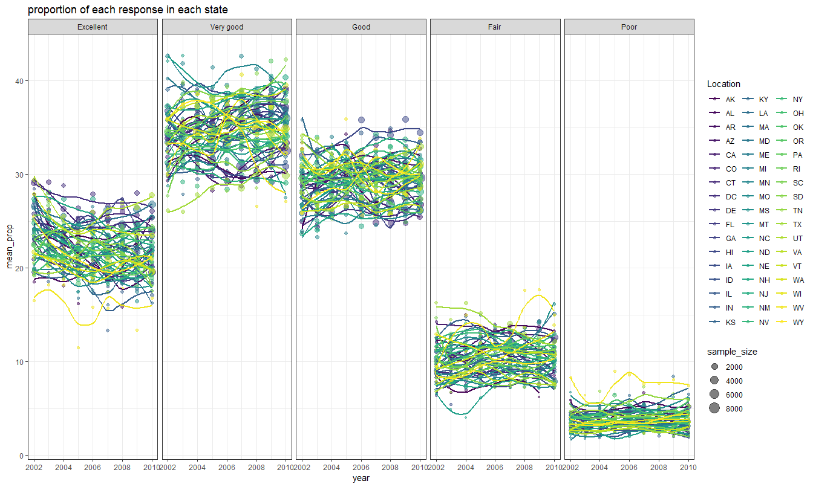

p8105\_hw3\_hh2767
================
Haoran Hu, hh2767
2018-10-09

Problem 1
=========

Data cleaning
-------------

``` r
brfss = janitor::clean_names(brfss_smart2010)
colnames(brfss)[2] = "location_abbr"
colnames(brfss)[3] = "location_desc"
brfss = filter(brfss, topic == "Overall Health") %>% 
   mutate(response = factor(response, levels = c("Excellent", "Very good", "Good", "Fair", "Poor"))) %>%
  arrange(response)
```

Answering questions
-------------------

### question 1

``` r
  filter(brfss, year == 2002) %>% 
  group_by(location_abbr) %>% 
  summarize(n_location = n_distinct(location_desc)) %>% 
  filter(n_location == 7)
```

    ## # A tibble: 3 x 2
    ##   location_abbr n_location
    ##   <chr>              <int>
    ## 1 CT                     7
    ## 2 FL                     7
    ## 3 NC                     7

From the result above, we know that in 2002, Connecticut, Florida, and North Carolina were observed at 7 locations.

### question 2

``` r
brfss %>% 
  group_by(year, location_abbr) %>% 
  summarize(n_location = n_distinct(location_desc)) %>% 
  ggplot(aes(x = year, y = n_location, color = location_abbr)) +
  labs(title = "number of locations observed", y = "number of locations") +
  geom_line() + geom_point() +
  theme_bw() + viridis::scale_color_viridis(
    name = "Location", 
    discrete = TRUE
  )
```


The plot above is a “spaghetti plot” that shows the number of locations in each state from 2002 to 2010. From the plot, we can see that in most of the states, number of locations observed is relative stable, with a little fluctuation. However, there are several states that have wide fluctuation, such as Florida.

### question 3

``` r
  brfss %>% 
  filter(location_abbr == "NY" & response == "Excellent") %>% 
  filter(year %in% c("2002", "2006", "2010")) %>% 
  group_by(year) %>% 
  summarize(`mean of prop. of "excellent" response` = round(mean(data_value, na.rm = TRUE),2), `sd of prop. of "excellent" response` = round(sd(data_value, na.rm = TRUE),2)) %>% 
  mutate(state = "NY") %>% 
  select(state, everything()) %>% 
  knitr::kable()
```

| state |  year|  mean of prop. of "excellent" response|  sd of prop. of "excellent" response|
|:------|-----:|--------------------------------------:|------------------------------------:|
| NY    |  2002|                                  24.04|                                 4.49|
| NY    |  2006|                                  22.53|                                 4.00|
| NY    |  2010|                                  22.70|                                 3.57|

The table is created as the requeste of the question. According to the table, we can see that the mean of the proportion of "excellent" response remains stable, while its standard deviation shows a slight trend of decreasing.

### question 4

``` r
theme_set(theme_bw())
brfss %>% 
  group_by(year, location_abbr, response) %>% 
  summarize(mean_prop = mean(data_value, na.rm = TRUE), sample_size = sum(sample_size)) %>% 
  ggplot(aes(x = year, y = mean_prop, color = location_abbr)) + geom_point(aes(size = sample_size), alpha = .5) + geom_smooth(se = FALSE) + labs(title = "proportion of each response in each state") + 
  facet_grid(~ response) +  viridis::scale_color_viridis(
    name = "Location", 
    discrete = TRUE
  )
```

    ## `geom_smooth()` using method = 'loess' and formula 'y ~ x'



The figure above is created as request of the question.The figure shows that the majority of people in each state responded "Excellent", "Very good", or "Good". What is interesting is that in each state, the proportion of each response is largely the same. In addition, the proportion of each response remains stable over the years.

Problem 2
=========

### question 1

``` r
 count = instacart %>% 
  count(aisle) %>% 
   arrange(-n)
```

There are 134 aisles, and "fresh vegetables" is ordered for the most times.

### question 2

First, in order to arrange the aisles according to the frequency that they are ordered when making the graph, I need to first turn the aisles in to ordered factor variables.

``` r
count$aisle = factor(count$aisle, levels = count$aisle)
```

Then, I can begin to make the graph.

``` r
order_over10k = ggplot(filter(count, n >= 10000), aes(x = aisle, y = n, color = aisle)) + geom_col() +  theme(legend.position = "bottom") + scale_x_discrete(breaks = NULL) + scale_y_continuous( limits = c(0, 160000)) + labs(title = "More than 10000 items ordered", y = "number of orders") 

order_3k_10K = ggplot(filter(count, n >= 3000 & n < 10000), aes(x = aisle, y = n, color = aisle)) + geom_col() +  theme(legend.position = "bottom") + scale_x_discrete(breaks = NULL) + labs(title = "3000 to 10000 items ordered", y = "number of orders")

ordre_less3k = ggplot(filter(count, n < 3000), aes(x = aisle, y = n, color = aisle)) + geom_col() +  theme(legend.position = "bottom") + scale_x_discrete(breaks = NULL) + labs(title = "Less than 3000 items ordered", y = "number of orders")

(order_over10k + order_3k_10K) / ordre_less3k
```


``` r
ggplot(filter(count, n >= 10000), aes(x = aisle, y = n)) + geom_col(fill = "red", color = "blue") +  theme(legend.position = "bottom") + scale_y_continuous( limits = c(0, 160000)) + labs(title = "More than 10000 items ordered", y = "number of orders") + coord_flip()
```


As the plot shows, the aisles are devided into three groups: orderd for more than 10000 times, oedered 3000 to 10000 times, and ordered less than 3000 times. For each of the group, a graph is made with the aisles arranged according to the frequency that they are ordered.

### question 3

``` r
instacart %>% 
  filter(aisle == "baking ingredients" | aisle == "dog food care" | aisle == "packaged vegetables fruits") %>%
  group_by(aisle, product_name) %>% 
  summarize(num_items_ordered = n()) %>% 
  group_by(aisle) %>% 
  mutate(rank = min_rank(desc(num_items_ordered))) %>% 
  filter(rank == 1) %>% 
  select(aisle, `most popular item` = product_name, `number of ordered items` = num_items_ordered) %>% 
  knitr::kable()
```

| aisle                      | most popular item                             |  number of ordered items|
|:---------------------------|:----------------------------------------------|------------------------:|
| baking ingredients         | Light Brown Sugar                             |                      499|
| dog food care              | Snack Sticks Chicken & Rice Recipe Dog Treats |                       30|
| packaged vegetables fruits | Organic Baby Spinach                          |                     9784|

The table above shows that the most popular item of baking ingredients is Light Brown Sugar, of which 499 items are ordered.The most popular item of dog food care is Snack Sticks Chicken & Rice Recipe Dog Treats, of which 30 items are ordered. The most popular item of packaged vegetables fruits is Organic Baby Spinach, of which 9784 items are ordered.

### question 4

Suppose that in the instacart data, the "order\_dow" variable indicates on which week day the items were ordered, and its value 0, 1, ..., 6 denotes sunday, monday, ..., sataurday, respectively.

``` r
instacart = instacart

  instacart %>% 
  filter(product_name %in% c("Pink Lady Apples", "Coffee Ice Cream")) %>% 
  group_by(product_name, order_dow) %>% 
  summarize(mean_order_hour = mean(order_hour_of_day)) %>% 
  spread(key = product_name, value = mean_order_hour) %>% 
  rename(weekday = order_dow) %>% 
  mutate(weekday = c("Sunday", "Monday", "Tuesday", "Wednesday", "Thursday", "Friday", "Sataurday")) %>% 
    knitr::kable(align = 'c', caption = "mean hour of the orders")
```

|  weekday  | Coffee Ice Cream | Pink Lady Apples |
|:---------:|:----------------:|:----------------:|
|   Sunday  |     13.77419     |     13.44118     |
|   Monday  |     14.31579     |     11.36000     |
|  Tuesday  |     15.38095     |     11.70213     |
| Wednesday |     15.31818     |     14.25000     |
|  Thursday |     15.21739     |     11.55172     |
|   Friday  |     12.26316     |     12.78431     |
| Sataurday |     13.83333     |     11.93750     |
